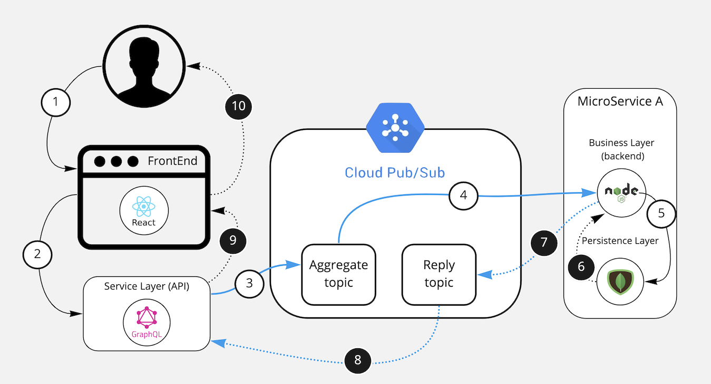
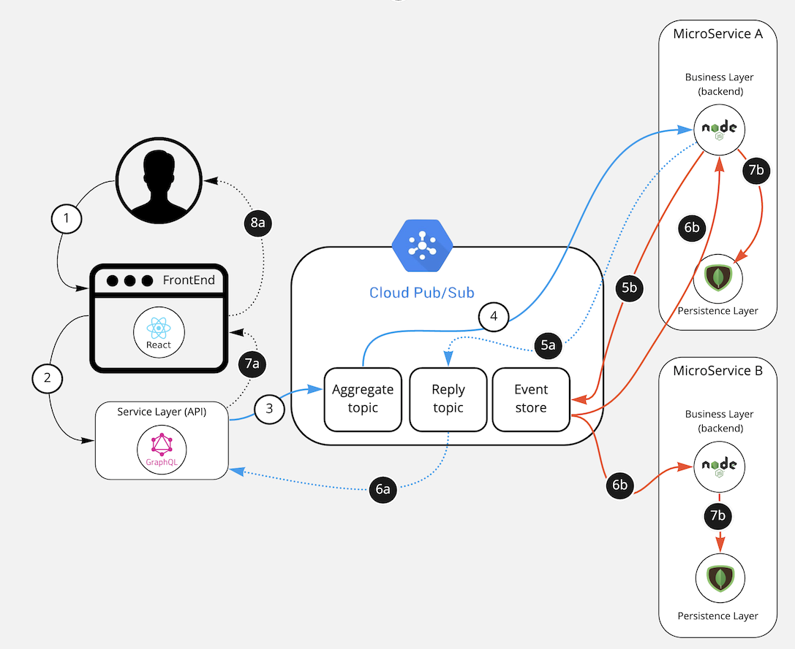
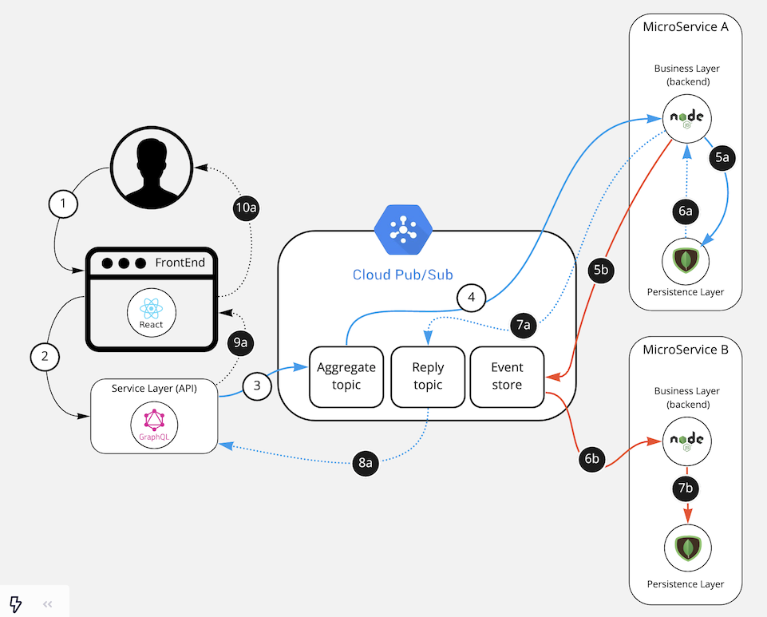

# NebulaE: Microservices Framework

NebulaE is a comprehensive framework and command-line interface (CLI) for building and managing cloud-native microservices. It simplifies the entire development lifecycle, from code generation and service registration to UI/API composition and deployment.

## Core Concepts

NebulaE is built on a foundation of well-established architectural patterns:

*   **Domain-Driven Design (DDD):** We model complex domains by focusing on the core business logic and breaking it down into independent, reactive modules called aggregates.
*   **CQRS (Command Query Responsibility Segregation):** We separate the models for reading and writing data, which allows for optimized data access patterns and improved scalability.
*   **Event Sourcing (ES):** All changes to the application state are captured as an immutable sequence of events. This provides a reliable audit trail, enables event replay, and facilitates a loosely coupled architecture.
*   **Full-Stack Microservices:** Each microservice is a self-contained, full-stack application, including its own frontend, backend, and data persistence layer.
*   **API/UI Composition:** We provide tools to compose a unified API and user interface from multiple, independent microservices.

## Architecture Overview

Providing and supporting high demand operations as needed by our solutions requires having a robust technological base with well known design patterns and best practices. The system is based on micro-services, this is a top-level pattern that is made up of dozens of sub-patterns to help break down the system into multiple, independent and reactive services with a very well defined responsibilitie. These services are indepent from the design, development, deployment and maintenance perspective.
To make feasible all the benefits offered by the micro-services standard, it is imperative to divide the system into independent µServices, with high cohesion and low coupling.

### Domain Driven Design

Domain-Driven-Design, known as DDD, is a set of practices and guidelines for designing modular system, where each of the modules is independent and reactive.
The first step is to completely forget the data-oriented designs since the worst mistake that can be make is to have a centralized data repository where the entire system is guided by the same entity-relationship design 'cause even if we divided the system In hundreds of backends, a change in the central data schema means a change in multiple backends and this means we lost µService independence.

The solution is implemented with Aggregates (ex. Device, User, Source) and the events that these aggregates can produce (ex. DeviceConnected, UserEnabled, SourceBlocked). At this point we favor basing the system on domain events and not on centralized data schemas. Having understood this, we can say that a µService in the ecosystem generates domain events and reacts to domain events produced by other µServices. This is the only point of interaction between µServices. Using domain-events each µService is free to create its own database (called materialized view) with the required scheme and technology.

If you want to learn more about DDD you could do so at:

*   [DDD Book](https://www.amazon.com/Domain-Driven-Design-Tackling-Complexity-Software/dp/0321125215)
*   [DDD Reference](https://domainlanguage.com/wp-content/uploads/2016/05/DDD_Reference_2015-03.pdf)

### CQRS & Event-Sourcing

Command-Query-Responsibility-Segregation dictates a µService must be broken into two parts, one for writing and one for reading.

Event-Sourcing dictates that the state of an aggregate is obtained by reducing all the events of said aggregate. To explain it a little better, Event Sourcing dicatates that everything that happens with an aggregate (Ex. Account) should be stored as a sequence of events (Enabled, Credited, Debited, Blocked, etc.) persisted in an event repository over time called event-store. And, in the case of the Account aggregate, to retrieve the status of a specific Account, you should query all the existing events of that Account and calculate the current status of the Account with them.

The NebulaE platform implements CQRS, where the writing part is carried out by the event-store and the reading part is carried out on a specific Database of the µService that is implemented in the technology and scheme that best suits the µService. The µService database is called the materialized view.


By implementing these techniques, multiple µServices can coexist on the Nebula platform without having to knwo other µServices. Each µService, as an independent processing unit, only react to events and generate other events.

### FullStack MicroServices

NebulaE's platforms are entirelly based µServices and each of these µServices are fullstack µServices:

*   **Presentation:** FrontEnd
*   **Service:** API-Gateway
*   **Business/Domain:** Backend
*   **Persistance/MaterializedView:** MongoDB most of the time
*   **Deployment:** GKE deployment specs (not included in the interview project)

NebulaE's platforms are composed by dozens of fullstack µServices. In order to avoid publishing dozens of web portals and api end-points the framework implements ui-composition and api-composition design patterns:

*   A FrontEnd SHELL is taken in place ready to include and publish all the micro-frontends from every µService.
*   A API SHELL is taken in place ready to include and publish all the micro-api from every µService.


In this way, the micro-service continues to be totally independent, as it contains all the required layers. And when the µService is being deployed then the micro-FrontEnd is hosted at the FrontEnd-Shell and the micro-API is hosted in the API-Shell.

Below is a high-level component diagram, which exposes the different modules and technologies applied on the NebulaE platform.


### MicroService data-flow

The following diagrams describes how all the layers of the µService interacts to achieve CQRS/ES reading and writing flows.

Diagrams leyend:

*   Solid line and white background numeral: Request flow - from the user to the processor
*   Dashed line and black background numeral: Response flow - from the procesor to the user
*   Black line: synchronous communications (blocking)
*   Blue Line: asynchronous communications (non-blocking using publish-subscribe)
*   Red Line: communications triggered by domain-events published in the event-store

#### READ: Querying data on the materialized view



1.  User makes a request to read information from the UI.
2.  The front-end makes a query using a synchronous HTTP call under the GraphQL API language.
3.  The API publishes the query request in the topic dedicated to the aggregate to which the query belongs to (eg Account).
4.  One of the µService's backend instances in charge of solving the request, obtaining the request from the aggregat-topic.
5.  The Backend queries the information in the materialized view.
6.  The materialized view returns the information of the queried aggregate.
7.  The backend publishes the result of the query in the response-topic.
8.  The API takes the answer from the respone-topic.
9.  The API returns the query response in the HTTP-RESPONSE of the original request.
10. The front-end displays the information of the query to the user.

#### WRITE (Pure CQRS/ES)

Pure CQRS/ES is only intended for complex and highly-concurrent micro-services. On DDD this would be the core microservices.

Writing data on the event-store and Materialized view:


1.  User performs a modification command from the UI.
2.  The front-end executes the command (mutation) by means of a synchronous HTTP call under the GraphQL language to the API.
3.  The API publishes the command in the topic dedicated to the aggregate to which the command belongs (eg Account).
4.  One of the µService's backend instances in charge of solving the request, obtaining the request from the aggregat-topic.

From here two simultaneous flows are opened, one to indicate to the user that the command has been executed successfully and the other to reduce the generated domain-event and update the materialized-view.

5a.The backend validates the conditions of the command to indicate if it is possible or not to make the change. If possible then responds with an ack meaning the command executed successfully. This answer is published in the response-topic.  
6a. The api takes the answer from the response-topic.  
7a. The api returns the command response in the HTTP-RESPONSE of the original request.  
8a. The front-end displays the command success confirmation.  

5b. The backend validates the conditions of the command to indicate if it is possible or not to make the change. If possible then the backend publishes a domain-event indicating the action taken on the aggregate (eg AccountEnabled).  
6b. The domain-event is shared to all µServices interested in that event.  
7b. The backend of each µService updates the materialized view as indicated by the event (Eg enabling the acount). The data is updated in the differents µServices ready to be query.  

#### WRITE (CRUD Strategy + ES)

CRUD Strategy + ES is intended for data-centric µServices, the idea is to combine a CRUD strategy instead of CQRS and generate domian-event every time an Aggregate changes in order to keep updated other µServices

Writing data on the materialized-view and publishing the event-domain:



1.  User performs a modification command from the UI.
2.  The front-end executes the command (mutation) by means of a synchronous HTTP call under the GraphQL language to the API.
3.  The API publishes the command in the topic dedicated to the aggregate to which the command belongs (eg Account).
4.  One of the µService's backend instances in charge of solving the request, obtaining the request from the aggregat-topic.

From here two simultaneous flows are opened, one to indicate to the user that the command has been executed successfully and the other to reduce the generated domain-event and update the materialized-view.

5a. The backend validates the conditions of the command to indicate if it is possible or not to make the change. If possible then Backend modifies the information in the materialized view and query the data after the update.
6a. The materialized view returns the information of the aggregate after being updated.
7a. The backend publishes the result of the command in the response-topic.
8a. The API takes the answer from the respone-topic.
9a. The API returns the command response in the HTTP-RESPONSE of the original request.
10a. The front-end displays the information of the command and the aggreate data after the update to the user.

5b. The backend validates the conditions of the command to indicate if it is possible or not to make the change. If possible then The backend publishes a domain-event indicating the action taken on the aggregate (eg AccountEnabled).
6b. The domain-event is shared to all µServices interested in that event.
7b. The backend of each µService updates the materialized view as indicated by the event (Eg enabling the acount). The data is updated in the differents µServices ready to be query.

## Getting Started

### Installation

```bash
npm install -g nebulae
```

## Command Line Interface

The `nebulae` CLI provides the following commands:

*   **`generate`:** Scaffolds a new microservice from a template.
*   **`register`:** Registers a microservice component (microfrontend, microbackend, or microapi) with the service directory.
*   **`compose-ui`:** Composes a unified user interface from multiple microfrontends.
*   **`compose-api`:** Composes a unified API from multiple micro-APIs.

### `generate microservice`

This command generates a new microservice from a template.

**Usage:**

```bash
nebulae generate microservice <frontend-id> <api-id> <project_context> <template-git-url> <repo-git-url> [crud-entity] <git-repo-directory-path>
```

**Arguments:**

| Argument | Description | Required | Sample |
| --- | --- | --- | --- |
| `<frontend-id>` | The ID of the frontend. | Yes | `emi` |
| `<api-id>` | The ID of the API. | Yes | `emi-gateway` |
| `<project_context>` | The project context. | Yes | `FLEET` |
| `<template-git-url>` | The URL of the template Git repository. | Yes | `https://github.com/NebulaEngineering/ms-template.git` |
| `<repo-git-url>` | The URL of the repository Git repository. | Yes | `https://github.com/nebulae-tpm/ms-device-manager.git` |
| `[crud-entity]` | (Optional) The name of the entity for CRUD operations if using a CRUD template. | No | `device` |
| `<git-repo-directory-path>` | The path to the Git repository directory. | Yes | `one-nebula/super-van-plus` |

**Examples:**

```bash
# Generate a microservice with a 'device' CRUD entity
nebulae generate microservice my-frontend my-api MY_PROJECT https://github.com/NebulaEngineering/ms-template.git https://github.com/myorg/my-microservice.git device my-project/my-microservice
```

### `register`

This command registers a microservice component with the service directory.

**Subcommands:**

*   `microfrontend`: Registers a microfrontend.
*   `microbackend`: Registers a microbackend.
*   `microapi`: Registers a micro-API.

#### `register microfrontend`

Registers the micro-frontend setup file on the service registry of the Microservices environment.

**Usage:**

```bash
nebulae register microfrontend <microservice-id> <frontend-id> <setup-file> --store-type=<store-type> [--gcp-service-account-token=<token-path>]
```

**Arguments:**

| Argument | Description | Required | Sample |
| --- | --- | --- | --- |
| `<microservice-id>` | The unique ID of the microservice. | Yes | `ms-device-manager` |
| `<frontend-id>` | The identifier of the frontend hosting the micro-frontend. | Yes | `emi` |
| `<setup-file>` | The path to the setup file (e.g., `etc/mfe-setup.json`). | Yes | `etc/mfe-setup.json` |
| `--store-type` | The type of service directory store to use. Currently, only `GCP_DATASTORE` is supported. | Yes | `GCP_DATASTORE` |
| `--gcp-service-account-token` | (Optional) The path to the Google Cloud Platform service account JSON key file. Required if `store-type` is `GCP_DATASTORE`. | No | `~/.gcp/key.json` |

**Examples:**

```bash
# Register a microfrontend using GCP_DATASTORE
nebulae register microfrontend --microservice-id=ms-my-service --frontend-id=my-app --setup-file=etc/mfe-setup.json --store-type=GCP_DATASTORE --gcp-service-account-token=.artifacts_prepare/gcloud-service-key.json
```

#### `register microbackend`

Registers the micro-backend setup file on the service registry of the Microservices environment.

**Usage:**

```bash
nebulae register microbackend <microservice-id> <setup-file> --store-type=<store-type> [--gcp-service-account-token=<token-path>]
```

**Arguments:**

| Argument | Description | Required | Sample |
| --- | --- | --- | --- |
| `<microservice-id>` | The unique ID of the microservice. | Yes | `ms-device-manager` |
| `<setup-file>` | The path to the setup file (e.g., `etc/mbe-setup.json`). | Yes | `etc/mbe-setup.json` |
| `--store-type` | The type of service directory store to use. Currently, only `GCP_DATASTORE` is supported. | Yes | `GCP_DATASTORE` |
| `--gcp-service-account-token` | (Optional) The path to the Google Cloud Platform service account JSON key file. Required if `store-type` is `GCP_DATASTORE`. | No | `~/.gcp/key.json` |

**Examples:**

```bash
# Register a microbackend using GCP_DATASTORE
nebulae register microbackend --microservice-id=ms-my-service --setup-file=etc/mbe-setup.json --store-type=GCP_DATASTORE --gcp-service-account-token=.artifacts_prepare/gcloud-service-key.json
```

#### `register microapi`

Registers the micro-API setup file on the service registry of the Microservices environment.

**Usage:**

```bash
nebulae register microapi <microservice-id> <api-id> <setup-file> --store-type=<store-type> [--gcp-service-account-token=<token-path>]
```

**Arguments:**

| Argument | Description | Required | Sample |
| --- | --- | --- | --- |
| `<microservice-id>` | The unique ID of the microservice. | Yes | `ms-device-manager` |
| `<api-id>` | The identifier of the API hosting the micro-API. | Yes | `emi-gateway` |
| `<setup-file>` | The path to the setup file (e.g., `etc/mapi-setup.json`). | Yes | `etc/mapi-setup.json` |
| `--store-type` | The type of service directory store to use. Currently, only `GCP_DATASTORE` is supported. | Yes | `GCP_DATASTORE` |
| `--gcp-service-account-token` | (Optional) The path to the Google Cloud Platform service account JSON key file. Required if `store-type` is `GCP_DATASTORE`. | No | `~/.gcp/key.json` |

**Examples:**

```bash
# Register a microapi using GCP_DATASTORE
nebulae register microapi --microservice-id=ms-my-service --api-id=my-api-gateway --setup-file=etc/mapi-extn-setup.json --store-type=GCP_DATASTORE --gcp-service-account-token=.artifacts_prepare/gcloud-service-key.json
```

### `compose-ui`

This command composes a unified user interface from multiple microfrontends.

**Environments:**

*   `development`: Composes the UI using microfrontends under development.
*   `production`: Composes the UI using all registered microfrontends.

#### `compose-ui development`

Composes a FrontEnd using the Micro-Frontends under development that are described at the setup file.

**Usage:**

```bash
nebulae compose-ui development --shell-type=<shell-type> --shell-repo=<shell-repo-url> --frontend-id=<frontend-id> --output-dir=<output-directory> --setup-file=<setup-file-path> [--shell-repo-branch=<branch>] [--shell-repo-user=<user>] [--shell-repo-psw=<password>]
```

**Arguments:**

| Argument | Description | Required | Sample |
| --- | --- | --- | --- |
| `--shell-type` | The type of UI Composition shell to use. E.g., `FUSE_REACT`. | Yes | `FUSE_REACT` |
| `--shell-repo` | The URL of the UI Composition shell repository. E.g., `https://gitlab.com/nebulaeng/fleet/emi.git` | Yes | `https://gitlab.com/nebulaeng/fleet/emi.git` |
| `--frontend-id` | The ID of the frontend. | Yes | `emi` |
| `--output-dir` | The directory to place the generated files. | Yes | `./dist` |
| `--setup-file` | The path to the setup file containing microfrontend configurations. | Yes | `../etc/mfe-setup.json` |
| `--shell-repo-branch` | (Optional) The branch of the shell repository. Defaults to `master`. | No | `develop` |
| `--shell-repo-user` | (Optional) The user for the shell repository, if authentication is required. | No | `myuser` |
| `--shell-repo-psw` | (Optional) The password or access token for the shell repository, if authentication is required. | No | `mypassword` |

**Examples:**

```bash
# FrontEnd - emi composition (HTTPS)
nebulae compose-ui development --shell-type=FUSE_REACT --shell-repo=https://gitlab.com/nebulaeng/fleet/emi.git --frontend-id=emi --output-dir=emi --setup-file=../etc/mfe-setup.json

# FrontEnd - pis composition (HTTPS)
nebulae compose-ui development --shell-type=FUSE_REACT --shell-repo=https://gitlab.com/nebulaeng/fleet/pis.git --frontend-id=pis --output-dir=pis --setup-file=../etc/mfe-pis-setup.json

# FrontEnd - pis composition (SSH)
nebulae compose-ui development --shell-type=FUSE_REACT --shell-repo=git@gitlab.com:nebulaeng/fleet/pis.git --frontend-id=pis --output-dir=pis --setup-file=../etc/mfe-pis-setup.json

# FrontEnd - pis abt composition
nebulae compose-ui development --shell-type=FUSE_REACT --shell-repo=https://gitlab.com/nebulaeng/fleet/pis-abt.git --frontend-id=pis-abt --output-dir=pis-abt --setup-file=../etc/mfe-pis-abt-setup.json
```

#### `compose-ui production`

Composes a FrontEnd using all the registered Micro-Frontends on the Microservice Directory.

**Usage:**

```bash
nebulae compose-ui production --shell-type=<shell-type> --shell-repo=<shell-repo-url> --frontend-id=<frontend-id> --output-dir=<output-directory> --store-type=<store-type> [--gcp-service-account-token=<token-path>] [--shell-finalEnvFile=<env-file>] [--shell-repo-branch=<branch>] [--shell-repo-user=<user>] [--shell-repo-psw=<password>]
```

**Arguments:**

| Argument | Description | Required | Sample |
| --- | --- | --- | --- |
| `--shell-type` | The type of UI Composition shell to use. E.g., `FUSE_REACT`. | Yes | `FUSE_REACT` |
| `--shell-repo` | The URL of the UI Composition shell repository. E.g., `https://gitlab.com/nebulaeng/fleet/emi.git` | Yes | `https://gitlab.com/nebulaeng/fleet/emi.git` |
| `--frontend-id` | The ID of the frontend. | Yes | `emi` |
| `--output-dir` | The directory to place the generated files. | Yes | `./dist` |
| `--store-type` | The type of service directory store to use. Currently, only `GCP_DATASTORE` is supported. | Yes | `GCP_DATASTORE` |
| `--gcp-service-account-token` | (Optional) The path to the Google Cloud Platform service account JSON key file. Required if `store-type` is `GCP_DATASTORE`. | No | `~/.gcp/key.json` |
| `--shell-finalEnvFile` | (Optional) The environment file to use when building the Angular project. | No | `prod.env` |
| `--shell-repo-branch` | (Optional) The branch of the shell repository. Defaults to `master`. | No | `master` |
| `--shell-repo-user` | (Optional) The user for the shell repository, if authentication is required. | No | `myuser` |
| `--shell-repo-psw` | (Optional) The password or access token for the shell repository, if authentication is required. | No | `mypassword` |

**Examples:**

```bash
# Compose UI for production with authentication and GCP_DATASTORE
nebulae compose-ui production --frontend-id=$FRONTEND_ID --shell-type=FUSE_REACT --shell-repo="https://gitlab.com/nebulaeng/fleet/$FRONTEND_ID.git" --shell-repo-branch="$branch" --shell-repo-user="$CONTAINER_REGISTRY_ACCESS_TOKEN_LOGIN" --shell-repo-psw="$CONTAINER_REGISTRY_ACCESS_TOKEN" --output-dir=".artifacts_build_emi/emi/" --store-type=GCP_DATASTORE --gcp-service-account-token=.artifacts_prepare/gcloud-service-key.json
```

### `compose-api`

This command composes a unified API from multiple micro-APIs.

**Environments:**

*   `development`: Composes the API using micro-APIs under development.
*   `production`: Composes the API using all registered micro-APIs.

#### `compose-api development`

Composes an API using the Micro-APIs under development that are described at the setup file.

**Usage:**

```bash
nebulae compose-api development --api-type=<api-type> --api-repo=<api-repo-url> --api-id=<api-id> --output-dir=<output-directory> --setup-file=<setup-file-path> [--api-repo-branch=<branch>] [--api-repo-user=<user>] [--api-repo-psw=<password>]
```

**Arguments:**

| Argument | Description | Required | Sample |
| --- | --- | --- | --- |
| `--api-type` | The type of API Composition shell to use. E.g., `NEBULAE_GATEWAY`. | Yes | `NEBULAE_GATEWAY` |
| `--api-repo` | The URL of the API Composition shell repository. E.g., `https://gitlab.com/nebulaeng/fleet/emi-gateway.git` | Yes | `https://gitlab.com/nebulaeng/fleet/emi-gateway.git` |
| `--api-id` | The ID of the API. | Yes | `emi-gateway` |
| `--output-dir` | The directory to place the generated files. | Yes | `./dist` |
| `--setup-file` | The path to the setup file containing micro-API configurations. | Yes | `../etc/mapi-setup.json` |
| `--api-repo-branch` | (Optional) The branch of the API repository. Defaults to `master`. | No | `develop` |
| `--api-repo-user` | (Optional) The user for the API repository, if authentication is required. | No | `myuser` |
| `--api-repo-psw` | (Optional) The password or access token for the API repository, if authentication is required. | No | `mypassword` |

**Examples:**

```bash
# API - GateWay composition (HTTPS)
nebulae compose-api development --api-type=NEBULAE_GATEWAY --api-repo=https://gitlab.com/nebulaeng/fleet/emi-gateway.git --api-id=emi-gateway --output-dir=emi-gateway --setup-file=../etc/mapi-setup.json

# PIS - Gateway composition (HTTPS)
nebulae compose-api development --api-type=NEBULAE_GATEWAY --api-repo=https://gitlab.com/nebulaeng/fleet/pis-gateway.git --api-id=pis-gateway --output-dir=pis-gateway --setup-file=../etc/mapi-pis-setup.json

# PIS - Gateway composition (SSH)
nebulae compose-api development --api-type=NEBULAE_GATEWAY --api-repo=git@gitlab.com:nebulaeng/fleet/pis-gateway.git --api-id=pis-gateway --output-dir=pis-gateway --setup-file=../etc/mapi-pis-setup.json

# API EXTERNAL NETWORK - GateWay composition (HTTPS)
nebulae compose-api development --api-type=NEBULAE_GATEWAY --api-repo=https://gitlab.com/nebulaeng/fleet//external-network-gateway.git --api-id=external-network-gateway --output-dir=external-network-gateway --setup-file=../etc/mapi-extn-setup.json

# API EXTERNAL NETWORK - GateWay composition (SSH)
nebulae compose-api development --api-type=NEBULAE_GATEWAY --api-repo=git@gitlab.com:nebulaeng/fleet/external-network-gateway.git --api-id=external-network-gateway --output-dir=external-network-gateway --setup-file=../etc/mapi-extn-setup.json

# PIS ABT- Gateway composition
nebulae compose-api development --api-type=NEBULAE_GATEWAY --api-repo=https://gitlab.com/nebulaeng/fleet/pis-abt-gateway.git --api-id=pis-abt-gateway --output-dir=pis-abt-gateway --setup-file=../etc/mapi-pis-abt-setup.json

# SSH example
nebulae compose-api development --api-type=NEBULAE_GATEWAY --api-repo=git@gitlab.com:nebulaeng/fleet/external-system-gateway.git --api-id=external-system-gateway --output-dir=external-system-gateway --setup-file=../etc/mapi-ext-setup.json
```

#### `compose-api production`

Composes an API using all the registered Micro-APIs on the Microservice Directory.

**Usage:**

```bash
nebulae compose-api production --api-type=<api-type> --api-repo=<api-repo-url> --api-id=<api-id> --output-dir=<output-directory> --store-type=<store-type> [--gcp-service-account-token=<token-path>] [--api-repo-branch=<branch>] [--api-repo-user=<user>] [--api-repo-psw=<password>]
```

**Arguments:**

| Argument | Description | Required | Sample |
| --- | --- | --- | --- |
| `--api-type` | The type of API Composition shell to use. E.g., `NEBULAE_GATEWAY`. | Yes | `NEBULAE_GATEWAY` |
| `--api-repo` | The URL of the API Composition shell repository. E.g., `https://gitlab.com/nebulaeng/fleet/emi-gateway.git` | Yes | `https://gitlab.com/nebulaeng/fleet/emi-gateway.git` |
| `--api-id` | The ID of the API. | Yes | `emi-gateway` |
| `--output-dir` | The directory to place the generated files. | Yes | `./dist` |
| `--store-type` | The type of service directory store to use. Currently, only `GCP_DATASTORE` is supported. | Yes | `GCP_DATASTORE` |
| `--gcp-service-account-token` | (Optional) The path to the Google Cloud Platform service account JSON key file. Required if `store-type` is `GCP_DATASTORE`. | No | `~/.gcp/key.json` |
| `--api-repo-branch` | (Optional) The branch of the API repository. Defaults to `master`. | No | `master` |
| `--api-repo-user` | (Optional) The user for the API repository, if authentication is required. | No | `myuser` |
| `--api-repo-psw` | (Optional) The password or access token for the API repository, if authentication is required. | No | `mypassword` |

**Examples:**

```bash
# Compose API for production with authentication and GCP_DATASTORE
nebulae compose-api production --api-id="external-network-gateway" --api-repo="https://gitlab.com/nebulaeng/fleet/$EXTERNAL_NETWORK_API_ID.git" --api-repo-branch="$branch" --api-repo-user="$CONTAINER_REGISTRY_ACCESS_TOKEN_LOGIN" --api-repo-psw="$CONTAINER_REGISTRY_ACCESS_TOKEN" --api-type=NEBULAE_GATEWAY --output-dir=".artifacts_build_external_network_gateway/external-network-gateway/" --store-type=GCP_DATASTORE --gcp-service-account-token=.artifacts_prepare/gcloud-service-key.json
```