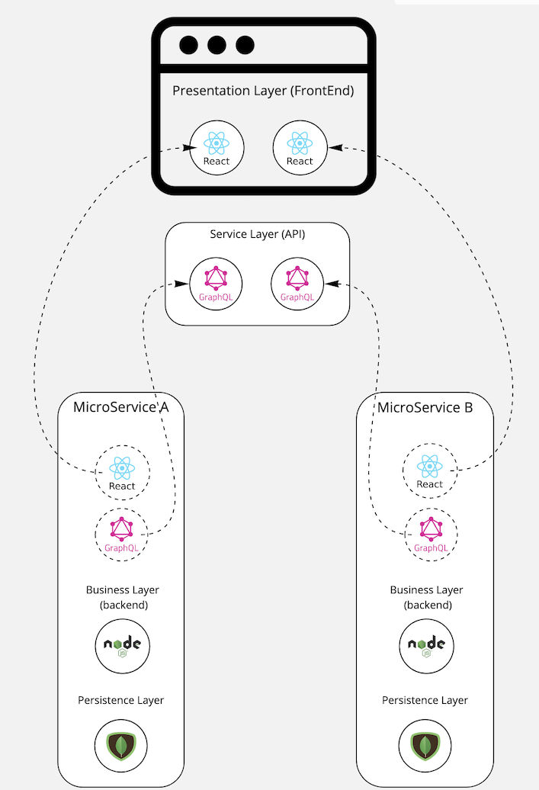

# NebulaE 


NebulaE is a compendium of code generators and tools to help build and deploy cloud native Microservices.  
The cli is meant to replace scripts needed to update datastores, upload files, configure environments and in the long run it will offer code generation to build back-ends, front-ends and middleware for microservices.

# Table of contents

- [Installation](#installation)
  - [Install as CLI](#install-as-cli)
- [Command Line Interface](#command-line-interface)
  - [Micro-Service Generator](#micro-service-generator)
  - [Micro-Service Registration](#micro-service-registration)
  - [Client-side UI-composition](#client-side-ui-composition)
  - [Client-side API-composition](#client-side-api-composition)
- [Architecture Overview](#architecture-overview)
  - [Domain Driven Design](#domain-driven-design)
  - [CQRS & Event-Sourcing](#cqrs--event-sourcing)
  - [FullStack MicroServices](#fullstack-microservices)
  - [MicroService data-flow](#microservice-data-flow)
    - [READ: Querying data on the materialized view](#read-querying-data-on-the-materialized-view)
    - [WRITE (Pure CQRS/ES)](#write-pure-cqrses)
    - [WRITE (CRUD Strategy + ES)](#write-crud-strategy--es)
- [Development Environment Setup](#development-environment-setup)
  - [Dev machine requiremnets](#dev-machine-requiremnets)
  - [Micro-Service generation from Template](#micro-service-generation-from-template)
  - [Prepare your local full-stack environment](#prepare-your-local-full-stack-environment)
    - [Compose UI](#compose-ui)
    - [Compose API](#compose-api)
  - [Start your local full-stack environment](#start-your-local-full-stack-environment)
    - [Deploy DB + MQTT using docker compose](#deploy-db--mqtt-using-docker-compose)
    - [Start the BackEnd](#start-the-backend)
    - [Start the API](#start-the-api)
    - [Start the FrontEnd](#start-the-frontend)
- [Author and Contributors](#author-and-contributors)
- [License <a name="license"></a>](#license-)

# Installation

Assuming that Node.js is already installed and running,

## Install as CLI
```sh
$ npm install -g @nebulae/cli
```

# Command Line Interface

## Micro-Service Generator

Generates a new Micro-Service from a project template.   The new Micro-Serice ready and functional out-of-the-box.

Command:
```sh
$ nebulae generate microservice <..arguments>
```

Arguments:
| Argument | Description | Required | Sample |
| -------- | ----------- | -------- | ------ |
| `--frontend-id` | Frontend-shell identifier.  this is the Frontend-shell hosting the Micro-Fronend | X | `emi` |
| `--api-id` | API-shell identifier.  this is the API-shell hosting the Micro-Api   | X | `emi-gateway` |
| `--project-context` | CICD and K8S context |  X | `FLEET` |
| `--template-git-url` | Template git repo URL | X | `https://github.com/NebulaEngineering/ms-template.git` |
| `--repo-git-url` | Desired git repo for the new Micro-Service. Project name should start with `ms-` | X | `https://github.com/NebulaEngineering/ms-some-name.git` |
| `--crud-entity` | If using CRUD template, this is the name (singular) of the aggregate to CRUD |   | `mobile-phone` |
| `--git-repo-directory-path` | In case of the git project being inside a git group/sub-group then this argument describes the inner path |  | `group/subgroup` in the case of `gitlab.com/group/subgroup/ms-some-name.git` |

Usage sample
```sh
$ nebulae generate microservice --frontend-id emi --api-id emi-gateway --project-context FLEET --template-git-url https://gitlab.com/nebulaeng/fleet/ms-micro-service-template  --git-repo-directory-path nebulaeng/fleet --repo-git-url https://gitlab.com/nebulaeng/fleet/ms-route-mng --crud-entity itinerary
```

## Micro-Service Registration

Registers a Micro-FrontEnd within the a FrontEnd-shell or a Micro-API within a API-shell.  
After a Micro-FrontEnd or Micro-API being registerd it will be assembled with the shell with the rest of the registered artifacts

Command:
```sh
$ nebulae register <artifact: microfrontend | microapi> <..arguments>
```

Artifact
| Artifact | Description |
| -------- | ----------- |
| microfrontend| will register a Micro-FrontEnd within a FrontEnd-shell |
| microapi | will register a Micro-API within an API-shell |

Arguments:
| Argument | Description | Required | Sample |
| -------- | ----------- | -------- | ------ |
| `--microservice-id` | Micro-Service unique name |  | `ms-route-mng` |
| `--frontend-id` | Frontend-shell identifier.  this is the Frontend-shell hosting the Micro-Fronend | Only when registering a Micro-FrontEnd | `emi` |
| `--api-id` | API-shell identifier.  this is the API-shell hosting the Micro-Api   | Only when registering a Micro-API | `emi-gateway` |
| `--setup-file` | Micro-FrontEnd or Micro-API setup file path within the repo |  X | `etc/mfe-setup.json` or `etc/mapi-setup.json` |
| `--store-type` | Store type used as service directory. valid types: `GCP_DATASTORE` | X | `GCP_DATASTORE` |
| `--gcp-service-account-token` | Google cloud Platform service account JSON key | Only if `--store-type=GCP_DATASTORE`  |  |

Usage sample
```sh
$ nebulae register microfrontend --microservice-id=ms-organnization-mng --frontend-id=emi --setup-file=etc/mfe-setup.json --store-type=GCP_DATASTORE --gcp-service-account-token=gcloud-service-key.json

$ nebulae register microapi --microservice-id=ms-organnization-mng --api-id=emi-gateway --setup-file=etc/mapi-ext-setup.json --store-type=GCP_DATASTORE --gcp-service-account-token=gcloud-service-key.json
```

## Client-side UI-composition

FrontEnds are composed from a single Shell and multiple Micro-FrontEnds.  The idea is to ensemble the frontend shell to host each Micro-FrontEnd.


Commands:
```sh
# Composing FrontEnd for local develoment
$ nebulae compose-ui production <...arguments>

# Composing FrontEnd for production environment
$ nebulae compose-ui development <...arguments>
```

Arguments:
| Argument | Description | Required | Sample |
| -------- | ----------- | -------- | ------ |
| `--frontend-id` | Frontend-shell identifier.  This is the Frontend-shell hosting the Micro-Fronend | X | `emi` |
| `--shell-type` | FrontEnd shell type.  Valid options are `FUSE2_ANGULAR` or `FUSE_REACT` |  X | `FUSE_REACT` |
| `--shell-repo` | Shell git repo URL | X | `"https://gitlab.com/nebulaeng/fleet/emi.git"` |
| `-shell-repo-branch` | Shell git repo branch |  | `master` |
| `--shell-repo-user` | Shell git repo user | Only if repo requires auth and the CLI is not already logged | `jhondoe` |
| `--shell-repo-psw` | Shell git repo user's password | Only if repo requires auth and the CLI is not already logged | `secret`
| `--output-dir` | Directory to place the generated files | X | `/tmp/output` |
| `--store-type` | Store type used as service directory. valid types: `GCP_DATASTORE` | Only when `production` is used | `GCP_DATASTORE` |
| `--gcp-service-account-token` | Google cloud Platform service account JSON key | Only if `--store-type=GCP_DATASTORE`  |  |
| `--setup-file` | Micro-FrontEnd setup file path within the repo |  Only if `development` is used | `etc/mfe-setup.json` |

Usage sample
```sh
# Composing FrontEnd for local develoment
$ nebulae compose-ui development --shell-type=FUSE_REACT --shell-repo=https://gitlab.com/nebulaeng/fleet/emi.git --frontend-id=emi --output-dir=emi  --setup-file=etc/mfe-setup.json

# Composing FrontEnd for production environment
$ nebulae compose-ui production  --frontend-id=emi --shell-type=FUSE_REACT --shell-repo=https://gitlab.com/nebulaeng/fleet/emi.git --shell-repo-branch=master --shell-repo-user=jhondoe --shell-repo-psw=secret --output-dir="/tmp/emi/" --store-type=GCP_DATASTORE --gcp-service-account-token=gcloud-service-key.json
```

## Client-side API-composition

APIs are composed from a single Shell and multiple Micro-APIs.  The idea is to ensemble the shell to host each Micro-API.


Commands:
```sh
# Composing API for local develoment
$ nebulae compose-api production <...arguments>

# Composing API for production environment
$ nebulae compose-api development <...arguments>
```

Arguments:
| Argument | Description | Required | Sample |
| -------- | ----------- | -------- | ------ |
| `--api-id` | API-shell identifier.  This is the API-shell hosting the Micro-Api   | X | `emi-gateway` |
| `--api-type` | API shell type.  Valid option is `NEBULAE_GATEWAY` for now | X | `NEBULAE_GATEWAY` |
| `--api-repo-branch` | Shell git repo URL | X | `"https://gitlab.com/nebulaeng/fleet/emi-gateway.git"` |
| `--api-repo-branchh` | Shell git repo branch |  | `master` |
| `--api-repo-user` | Shell git repo user | Only if repo requires auth and the CLI is not already logged | `jhondoe` |
| `--api-repo-psw` | Shell git repo user's password | Only if repo requires auth and the CLI is not already logged | `secret` 
| `--output-dir` | Directory to place the generated files | X | `/tmp/output` |
| `--store-type` | Store type used as service directory. valid types: `GCP_DATASTORE` | Only when `production` is used | `GCP_DATASTORE` |
| `--gcp-service-account-token` | Google cloud Platform service account JSON key | Only if `--store-type=GCP_DATASTORE`  |  |
| `--setup-file` | Micro-API setup file path within the repo |  Only if `development` is used | `etc/mapi-setup.json` |

Usage sample
```sh
# Composing API for local develoment
$ nebulae compose-api development --api-type=NEBULAE_GATEWAY --api-repo=https://gitlab.com/nebulaeng/fleet/emi-gateway.git --api-id=emi-gateway --output-dir=/tmp/emi-gateway  --setup-file=etc/mapi-setup.json

# Composing API for production environment
$ nebulae compose-api production --api-id=emi-gateway --api-repo="https://gitlab.com/nebulaeng/fleet/emi-gateway.git" --api-repo-branch=master --api-repo-user=jhondoe --api-repo-psw=secret --api-type=NEBULAE_GATEWAY --output-dir="/tmp/emi-gateway/" --store-type=GCP_DATASTORE --gcp-service-account-token=gcloud-service-key.json
```

# Architecture Overview

Providing and supporting high demand operations as needed by our solutions requires having a robust technological base with well known design patterns and best practices.  
The system is based on micro-services, this is a top-level pattern that is made up of dozens of sub-patterns to help break down the system into multiple, independent and reactive services with a very well defined responsibilitie.  These services are indepent from the design, development, deployment and maintenance perspective.  
To make feasible all the benefits offered by the micro-services standard, it is imperative to divide the system into independent µServices, with high cohesion and low coupling.  

## Domain Driven Design

Domain-Driven-Design, known as DDD, is a set of practices and guidelines for designing modular system, where each of the modules is independent and reactive.  
The first step is to completely forget the data-oriented designs since the worst mistake that can be make is to have a centralized data repository where the entire system is guided by the same entity-relationship design 'cause even if we divided the system In hundreds of backends, a change in the central data schema means a change in multiple backends and this means we lost µService independence.

The solution is implemented with Aggregates (ex. Device, User, Source) and the events that these aggregates can produce (ex. DeviceConnected, UserEnabled, SourceBlocked). At this point we favor basing the system on domain events and not on centralized data schemas. Having understood this, we can say that a µService in the ecosystem generates domain events and reacts to domain events produced by other µServices.  This is the only point of interaction between µServices. Using domain-events each µService is free to create its own database (called materialized view) with the required scheme and technology.  

If you want to learn more about DDD you could do so at:
- [DDD Book](https://www.amazon.com/Domain-Driven-Design-Tackling-Complexity-Software/dp/0321125215)
- [DDD Reference](https://domainlanguage.com/wp-content/uploads/2016/05/DDD_Reference_2015-03.pdf)

## CQRS & Event-Sourcing
Command-Query-Responsibility-Segregation dictates a µService must be broken into two parts, one for writing and one for reading.  

Event-Sourcing dictates that the state of an aggregate is obtained by reducing all the events of said aggregate. To explain it a little better, Event Sourcing dicatates that everything that happens with an aggregate (Ex. Account) should be stored as a sequence of events (Enabled, Credited, Debited, Blocked, etc.) persisted in an event repository over time called event-store. And, in the case of the Account aggregate, to retrieve the status of a specific Account, you should query all the existing events of that Account and calculate the current status of the Account with them.  

The NebulaE platform implements CQRS, where the writing part is carried out by the event-store and the reading part is carried out on a specific Database of the µService that is implemented in the technology and scheme that best suits the µService. The µService database is called the materialized view.  


By implementing these techniques, multiple µServices can coexist on the Nebula platform without having to knwo other µServices. Each µService, as an independent processing unit, only react to events and generate other events.  

## FullStack MicroServices

NebulaE's platforms are entirelly based µServices and each of these µServices are fullstack µServices:
- Presentation: FrontEnd
- Service: API-Gateway
- Business/Domain: Backend
- Persistance/MaterializedView: MongoDB most of the time
- Deployment: GKE deployment specs (not included in the interview project)

NebulaE's platforms are composed by dozens of fullstack µServices.  In order to avoid publishing dozens of web portals and api end-points the framework implements ui-composition and api-composition design patterns:
- A FrontEnd SHELL is taken in place ready to include and publish all the micro-frontends from every µService.  
- A API SHELL is taken in place ready to include and publish all the micro-api from every µService.  




In this way, the micro-service continues to be totally independent, as it contains all the required layers.  And when the µService is being deployed then the micro-FrontEnd is hosted at the FrontEnd-Shell and the micro-API is hosted in the API-Shell.

Below is a high-level component diagram, which exposes the different modules and technologies applied on the NebulaE platform.


## MicroService data-flow

The following diagrams describes how all the layers of the µService interacts to achieve CQRS/ES reading and writing flows.  

Diagrams leyend:
- Solid line and white background numeral: Request flow - from the user to the processor
- Dashed line and black background numeral: Response flow -  from the procesor to the user
- Black line: synchronous communications (blocking)
- Blue Line: asynchronous communications (non-blocking using publish-subscribe)
- Red Line: communications triggered by domain-events published in the event-store

### READ: Querying data on the materialized view


1. User makes a request to read information from the UI. 
2. The front-end makes a query using a synchronous HTTP call under the GraphQL API language.  
3. The API publishes the query request in the topic dedicated to the aggregate to which the query belongs to (eg Account). 
4. One of the µService's backend instances in charge of solving the request, obtaining the request from the aggregat-topic.  
5. The Backend queries the information in the materialized view. 
6. The materialized view returns the information of the queried aggregate. 
7. The backend publishes the result of the query in the response-topic. 
8. The API takes the answer from the respone-topic. 
9. The API returns the query response in the HTTP-RESPONSE of the original request. 
10. The front-end displays the information of the query to the user. 


### WRITE (Pure CQRS/ES)
Pure CQRS/ES is only intended for complex and highly-concurrent micro-services.  On DDD this would be the core microservices.

Writing data on the event-store and Materialized view:


1. User performs a modification command from the UI. 
2. The front-end executes the command (mutation) by means of a synchronous HTTP call under the GraphQL language to the API.  
3. The API publishes the command in the topic dedicated to the aggregate to which the command belongs (eg Account). 
4. One of the µService's backend instances in charge of solving the request, obtaining the request from the aggregat-topic.  

From here two simultaneous flows are opened, one to indicate to the user that the command has been executed successfully and the other to reduce the generated domain-event and update the materialized-view.  

5a.The backend validates the conditions of the command to indicate if it is possible or not to make the change. If possible then responds with an ack meaning the command executed successfully. This answer is published in the response-topic.  
6a. The api takes the answer from the response-topic.  
7a. The api returns the command response in the HTTP-RESPONSE of the original request.  
8a. The front-end displays the command success confirmation.  


5b. The backend validates the conditions of the command to indicate if it is possible or not to make the change. If possible then the backend publishes a domain-event indicating the action taken on the aggregate (eg AccountEnabled).  
6b. The domain-event is shared to all µServices interested in that event.  
7b. The backend of each µService updates the materialized view as indicated by the event (Eg enabling the acount). The data is updated in the differents µServices ready to be query.  

### WRITE (CRUD Strategy + ES)
CRUD Strategy + ES is intended for data-centric µServices, the idea is to combine a CRUD strategy instead of CQRS and generate domian-event every time an Aggregate changes in order keep updated other µServices


Writing data on the materialized-view and publishing the event-domain:


1. User performs a modification command from the UI. 
2. The front-end executes the command (mutation) by means of a synchronous HTTP call under the GraphQL language to the API.  
3. The API publishes the command in the topic dedicated to the aggregate to which the command belongs (eg Account). 
4. One of the µService's backend instances in charge of solving the request, obtaining the request from the aggregat-topic.  

From here two simultaneous flows are opened, one to indicate to the user that the command has been executed successfully and the other to reduce the generated domain-event and update the materialized-view.  

5a. The backend validates the conditions of the command to indicate if it is possible or not to make the change. If possible then Backend modifies the information in the materialized view and query the data after the update.  
6a. The materialized view returns the information of the aggregate after being updated.  
7a. The backend publishes the result of the command in the response-topic.  
8a. The API takes the answer from the respone-topic.  
9a. The API returns the command response in the HTTP-RESPONSE of the original request.  
10a. The front-end displays the information of the command and the aggreate data after the update to the user.  

5b. The backend validates the conditions of the command to indicate if it is possible or not to make the change. If possible then The backend publishes a domain-event indicating the action taken on the aggregate (eg AccountEnabled).  
6b. The domain-event is shared to all µServices interested in that event.  
7b. The backend of each µService updates the materialized view as indicated by the event (Eg enabling the acount). The data is updated in the differents µServices ready to be query.  


# Development Environment Setup

## Dev machine requiremnets

- [Node 10.16.3](https://nodejs.org/) (LTS)
- [@nebulae/cli 0.5.0](https://www.npmjs.com/package/@nebulae/cli) (Global install)
- [nodemon](https://www.npmjs.com/package/nodemon)  (Global install)
- [gulp](https://www.npmjs.com/package/gulp)  (Global install)
- docker
- docker-copose
- vscode
- Mongo Client (CLI or UI)
- MQTT Client (eg. [MQTT BOX](http://workswithweb.com/mqttbox.html))

## Micro-Service generation from Template

```
nebulae generate microservice --frontend-id emi --api-id emi-gateway --project-context INTERVIEW --template-git-url https://github.com/nebulae-interview/ms-micro-service-template  --git-repo-directory-path interview  --repo-git-url https://github.com/nebulae-interview/[Micro-SERVICE-NAME] --crud-entity [AGGREGATE-NAME]
```

Where: 
- '[Micro-SERVICE-NAME]' => MicroServices name.   should start with "ms-"  and then the name you choose. Please use hyphen (-) for composed names.  Valid examples:
  - ms-interview
  - ms-interview-jhon-doe
  - ms-some-name

- [AGGREGATE-NAME] => CRUD aggregate name.  Valid examples:
  - computer
  - computer-service
  - source
  - bird

- for the rest of the params you can view them using ```nebulae generate microservice --help```

Then you can open the Micro-Service using code.   eg.   '> code ./ms-zoo/'  

CLI generation sample:
```
# generate ms-interview microservice with source CRUD
nebulae generate microservice --frontend-id emi --api-id emi-gateway --project-context INTERVIEW --template-git-url https://github.com/nebulae-interview/ms-micro-service-template  --git-repo-directory-path interview  --repo-git-url https://github.com/nebulae-interview/ms-interview --crud-entity source


# open vscode 
code ms-interview/ 
```


## Prepare your local full-stack environment

these steps are only neccesary the first time you want to prepare the local dev environment.  after configuring this you can skip to the (Start your local full-stack environment) chapter.

Please open the .sh file at ```playgorund/generate_playground.sh``` there you will find two commands.  One to compose the dev UI environment and other to compose the dev API environment.  this commands MUST BE EXECUTED WITHIN the ```playground``` directory.

### Compose UI

Compose-UI means taking the FrontEnd-Shell of the platform and link it to the Micro-FrontEnd development so developers can have an integrated environment to test the Micro-FrontEnd in the real shell.

Please find the right CLI command in the ```playgorund/generate_playground.sh```.  the following is an example of the ```ms-interview``` Micro-Service.
```
# navigate to the Playgrounf folder
cd playground/

# FrontEnd - EMI composition
nebulae compose-ui development --shell-type=FUSE_REACT --shell-repo=https://github.com/nebulae-interview/emi.git --frontend-id=emi --output-dir=emi  --setup-file=../etc/mfe-setup.json
```

### Compose API

Compose-API means taking the API-Shell of the platform and link it to the Micro-API development so developers can have an integrated environment to test the Micro-API in the real shell.

Please find the right CLI command in the ```playgorund/generate_playground.sh```.  the following is an example of the ```ms-interview``` Micro-Service.
```
# navigate to the Playgrounf folder
cd playground/

# API - GateWay composition
nebulae compose-api development --api-type=NEBULAE_GATEWAY --api-repo=https://github.com/nebulae-interview/emi-gateway.git --api-id=emi-gateway --output-dir=emi-gateway  --setup-file=../etc/mapi-setup.json
```

  
## Start your local full-stack environment

### Deploy DB + MQTT using docker compose

Using the CLI navigate to the playground folder and use docker compose to run DB/MQTT containers
```
# navigate to the playgorund folder (within the Micro-Service directory)
cd playground/

# start containers
docker-compose up

# for shutting down please use 'ctrl'+c (cmd+c on mac) and then
docker-compose down
```

### Start the BackEnd

Navigate to the Micro-Backend directory, install node_modules and start the server.  
the following is an example for the ```ms-interview``` Micro-Service.
``` 
# navigate the the Micro-Backend
cd backend/interview/

# install NPM packages
npm i

# start backend server
nodemon bin/entry-point/server.js


```

### Start the API

Navigate to the playground/emi-gateway directory and start the server on development mode.   dev mode means that a Gulp routine is going to keep your Micro-API code in sync with the playground.

``` 
# navigate the the API
cd playground/emi-gateway

# start server
npm run dev
```

After running the server you can navigate to the following links:
- HTTP END POINT: http://localhost:3000/api/emi-gateway/graphql/http
- WEBSOCKET END POINT: ws://localhost:3000/api/emi-gateway/graphql/ws
- GRAPHIQL PAGE: http://localhost:3000/api/emi-gateway/graphql/http


### Start the FrontEnd

Navigate to the playground/emi directory and start the server on development mode.   dev mode means that a routine is going to keep your Micro-FrontEnd code in sync with the playground.

``` 
# navigate the the FrontEnd
cd playground/emi

# start server
yarn run dev
```

After running the server you can navigate to the following link:
http://localhost:4000/


# Author and Contributors

Developed  maintained by author: <b>Sebastian Molano on behalf of Nebula Engineering SAS</b><br>
Follow Nebula Engineering at: <a href="https://github.com/NebulaEngineering" target="_blank">github</a>

# License <a name="license"></a>

Copyright 2018 Nebula Engineering SAS

The MIT License

    https://opensource.org/license/mit


Permission is hereby granted, free of charge, to any person obtaining a copy of this software and associated documentation files (the “Software”), to deal in the Software without restriction, including without limitation the rights to use, copy, modify, merge, publish, distribute, sublicense, and/or sell copies of the Software, and to permit persons to whom the Software is furnished to do so, subject to the following conditions:

The above copyright notice and this permission notice shall be included in all copies or substantial portions of the Software.

THE SOFTWARE IS PROVIDED “AS IS”, WITHOUT WARRANTY OF ANY KIND, EXPRESS OR IMPLIED, INCLUDING BUT NOT LIMITED TO THE WARRANTIES OF MERCHANTABILITY, FITNESS FOR A PARTICULAR PURPOSE AND NONINFRINGEMENT. IN NO EVENT SHALL THE AUTHORS OR COPYRIGHT HOLDERS BE LIABLE FOR ANY CLAIM, DAMAGES OR OTHER LIABILITY, WHETHER IN AN ACTION OF CONTRACT, TORT OR OTHERWISE, ARISING FROM, OUT OF OR IN CONNECTION WITH THE SOFTWARE OR THE USE OR OTHER DEALINGS IN THE SOFTWARE.